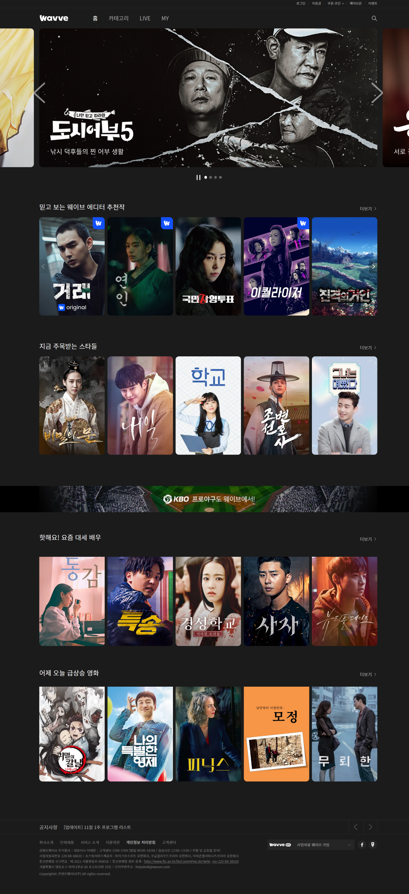

# 
 웨이브 클론 프로젝트

코딩을 배우기 시작한 지 한 달 차에 진행한 프로젝트입니다.

팀원들과 배운 것을 모두 사용할 수 있는 것을 찾다 웨이브 홈페이지를 선택하게 되었습니다.

## 개요
- 프로젝트 기간 : 2023.07.07 ~ 2023.07.14 (7일)

- 사용한 스킬 : HTML, CSS, JavaScript

- 팀원 : 표준태(조장), 이윤정, 조은경, 허재혁, 허재화
## 프로젝트 설명

