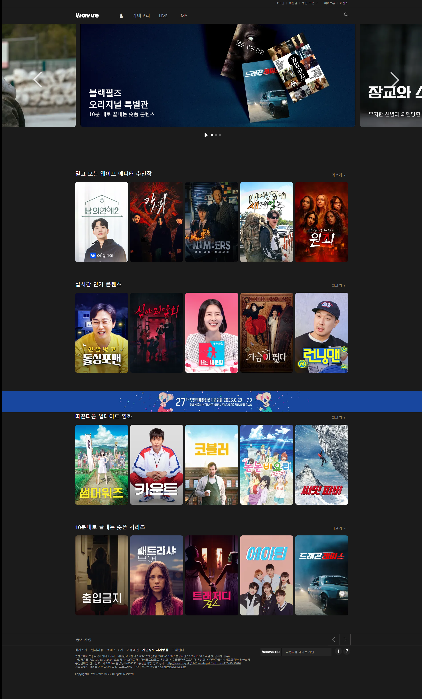
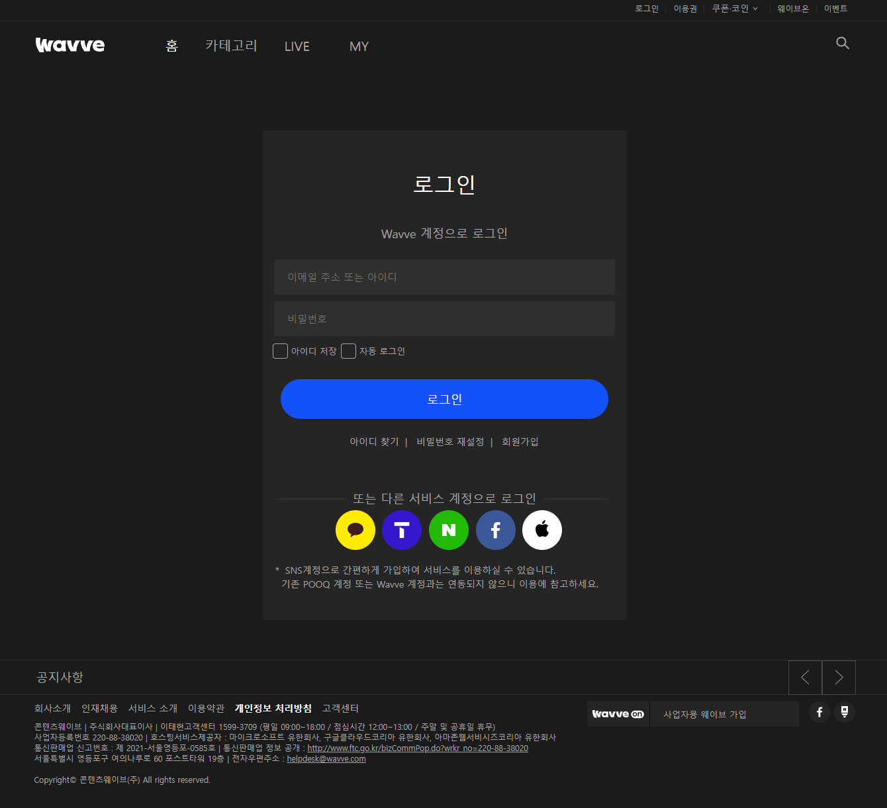
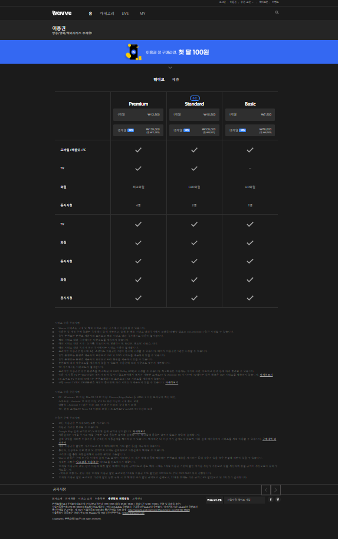
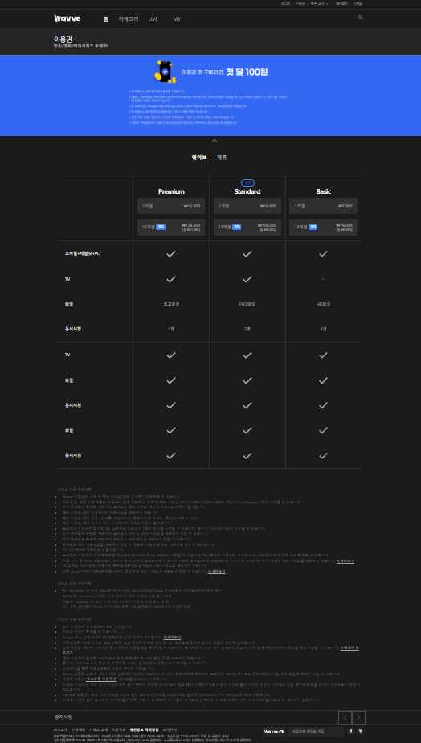
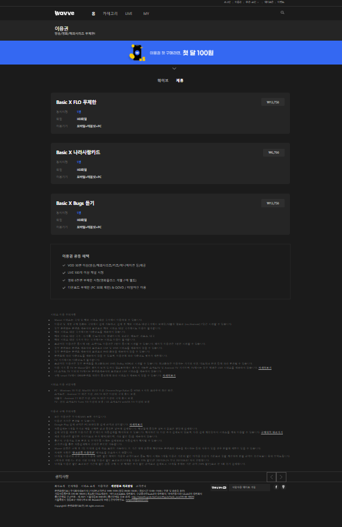
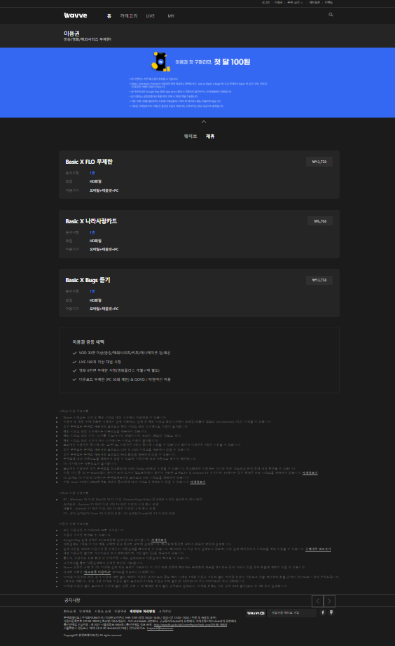

# 
 웨이브 클론 프로젝트

코딩을 배우기 시작한 지 한 달 차에 진행한 프로젝트입니다.

팀원들과 배운 것을 모두 사용할 수 있는 것을 찾다 웨이브 홈페이지를 선택하게 되었습니다.

## 개요
- 프로젝트 기간 : 2023.07.07 ~ 2023.07.14 (7일)

- 사용한 스킬 : HTML, CSS, JavaScript

- 팀원 : 표준태(조장), 이윤정, 조은경, 허재혁, 허재화
## 프로젝트 설명
- 홈화면(표준태,허재혁,허재화)

|실제 웨이브 홈페이지|클론 웨이브 홈페이지|
|---|---|
|| |

표준태: JavaScript를 통한 메인 슬라이드 자동, 클릭, 정지 기능 구현

허재혁: JavaScript를 통한 서브 슬라이드 클릭시 묶음으로 이동 , 슬라이드 끝에서 멈추는 기능 구현

허재화: css 기능을 사용하여 해더 영역 클론
- 내비게이션 파트 (이윤정, 조은경, 허재화)

|로그인|이용권||웨이브온|이벤트|
|---|---|---|---|---|
||||이미지3|이미지4|
||||이미지3|이미지4|
